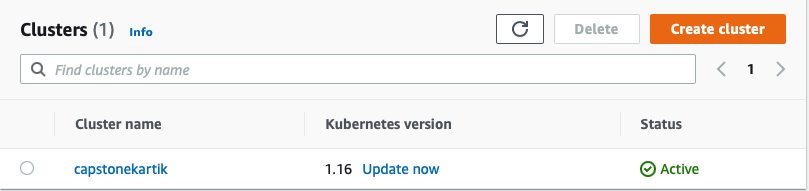
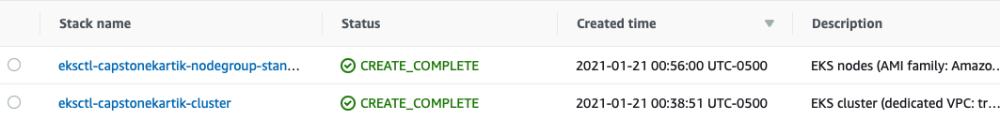
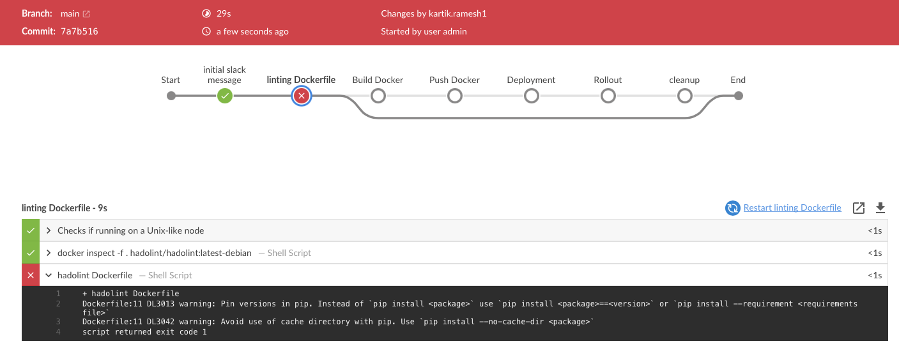
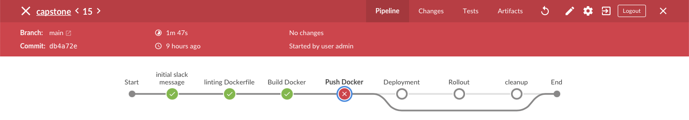
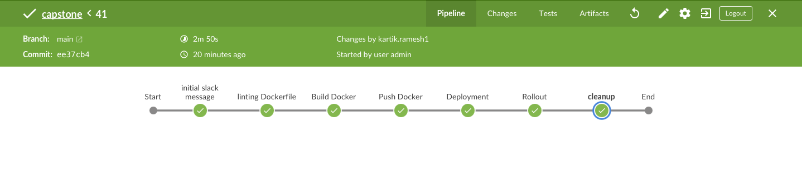
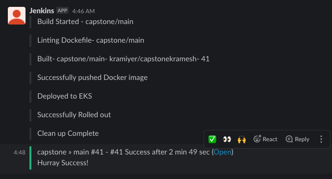
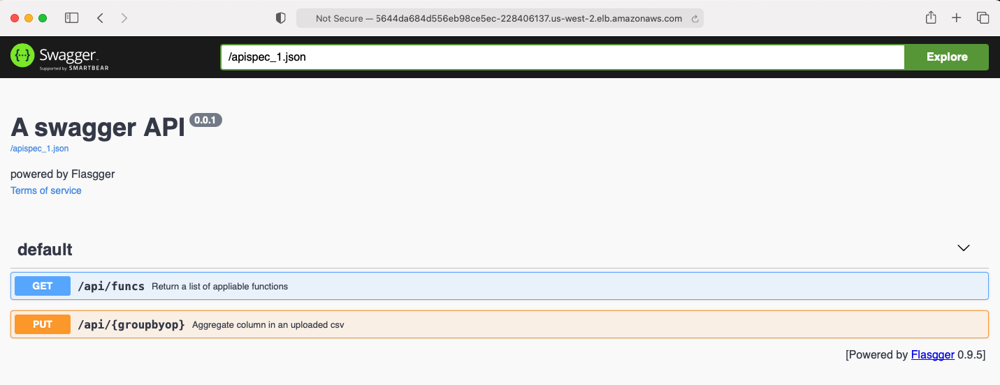
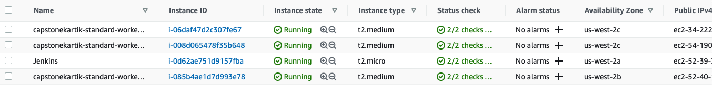

# Project: DevOps Nanodegree Capstone

In this project we will apply the skills and knowledge which were developed throughout the Cloud DevOps Nanodegree program.

In this capstone project we would try to implement the skills learnt during the nano degree program.

These include:

- Using AWS as cloud service.
- Using Jenkins for implementing CI/CD
- Using GitHub for versioning.
- Building pipelines
- Using Cloudformation
- Building Docker containers in Jenkins pipeline
- Building Kubernetes clusters
- Test locally before check-in to Code Repository

We will create a CI/CD pipeline for swagger api with rolling deployment. The Swagger api is an flask app written in Python. We would containerize usign docker. Build the docker image and push it to Docker Hub. we will use the sucessfully built docker image and deploy to AWS kubernetes with worker nodes and ELB. We will use slack for build notification and Hado lint for linting the docker file.

## Steps to be followed

1. Setting up the Jenkins instance - I have used an EC2 instance with ubuntu 18.04 for jenkins. Added jenkins plugin like blue ocean , pipeline:aws steps , slack. I added Jenkins app in slack and declared the workspace and channel in Jenkins.

2. Set up the EKS cluster - i used eksctl. cluster will be created.

   `eksctl create cluster --name capstonekartik --version 1.16 --nodegroup-name standard-workers --node-type t2.medium --nodes 3 --nodes-min 1 --nodes-max 4 --node-ami auto --region us-west-2`

   

3. Once we run the above command, if it runs succesfully you should see two stacks created in cloud formation

   

4. When a pipeline fails , it will show up in red like in the screenshot below. Depending on the stage where it fails
   Failing linting of Docker file.
   

   Failing at building docker stage itself.
   

5. Once the issues are fixed and everything woks fine. Pipelien should look all green.

   

6. Slack Ntification in the app.

   

7. Retreive ELB url and add 8080 at the end of the url. If you have access to the jenkin stage you can run the below command

   `kubectl get service/capstonekartik`

8. Opening the app using ELB URL and adding the port 9080 which i'm using to talk to the application.

   

9. To check if the nodes are all up and working , login into aws amangement console and navigate to EC2 dashboard we should see the same omount of instances we mentioned in our cluster.yml.

   

### Issues

I will keep updating this section regarding the issues , errors and what we need to do to resolve the issue.
